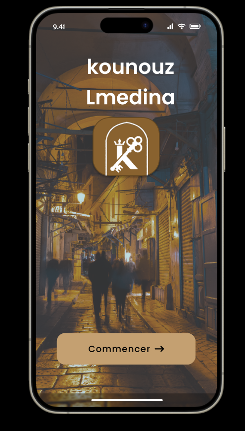
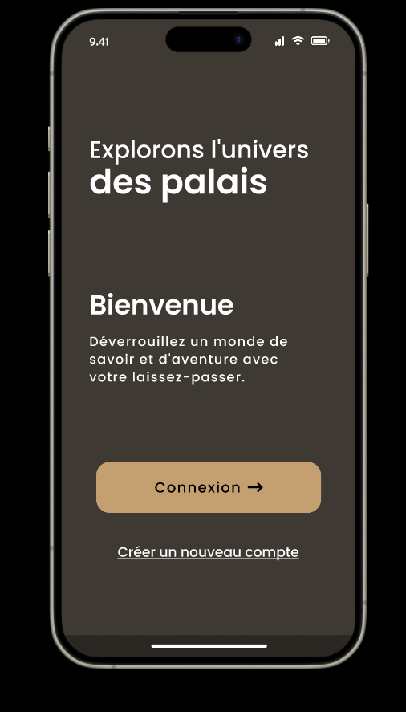
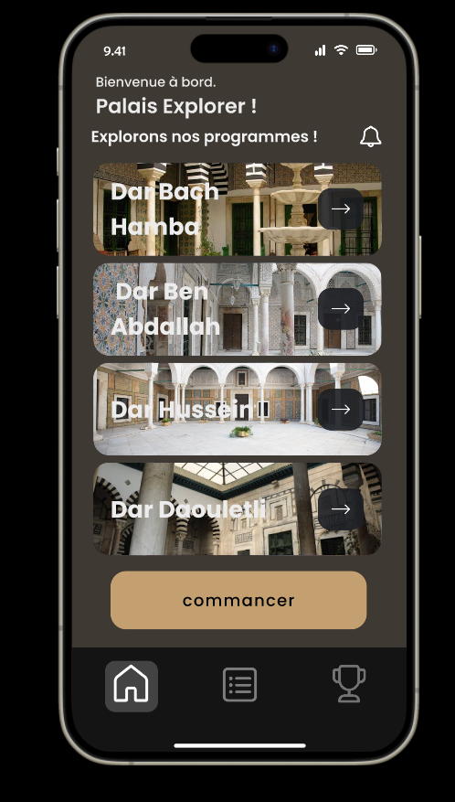
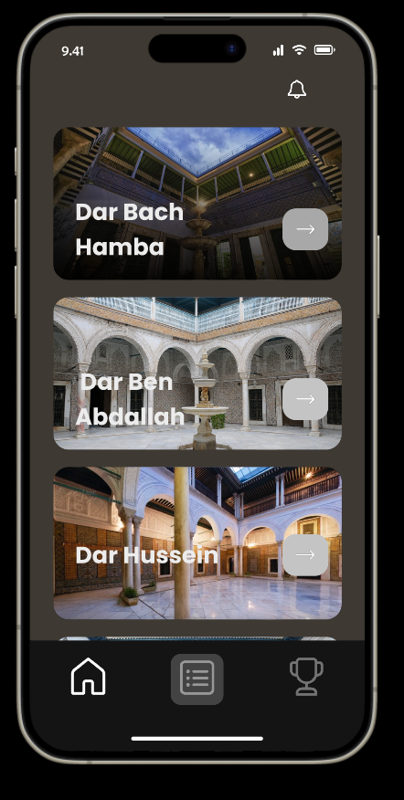

# Découverte Palais de Tunis - Application Gamifiée

## À Propos

Bienvenue dans notre application de parcours gamifié dédiée à la découverte immersive des palais de la médina de Tunis. Conçue pour les étudiants et les jeunes de 18 à 32 ans, cette application allie divertissement et éducation en intégrant des éléments ludiques inspirés des jeux vidéo, tels que des scénarios captivants, des défis stimulants, des récompenses attrayantes, et une interactivité engageante.

Pour voir la conception visuelle du projet, consultez [ce lien Figma](https://www.figma.com/file/5gnOoOPC6i1tlTfXFVui2x/EXPLORATION-GAMIFI%C3%89E-DES-PALAIS?type=design&node-id=0%3A1&mode=design&t=s6aHhbCpJcL0LQ7h-1).

## Objectifs

Notre initiative vise à sensibiliser, éduquer et engager les utilisateurs dans la richesse culturelle du centre-ville de Tunis, en mettant en lumière les monuments historiques, les édifices religieux, les maisons beylicaux, les espaces culturels, les parcs et bien plus encore. À travers ce projet, nous offrons une expérience interactive et ludique pour découvrir le patrimoine de manière innovante.

## Fonctionnalités

- Parcours gamifié à travers les palais de la médina de Tunis.
- Scénarios d'exploration avec des défis et des récompenses.
- Informations détaillées sur chaque lieu visité.
- Interaction sociale avec d'autres participants.
- Statistiques de progression individuelle et collective.

## Captures d'écran






## Installation

1. Clonez le référentiel :

   ```bash
   git clone https://github.com/Habibdrira/Exploration-Gamifi-e-UX-UI.git

   ```
